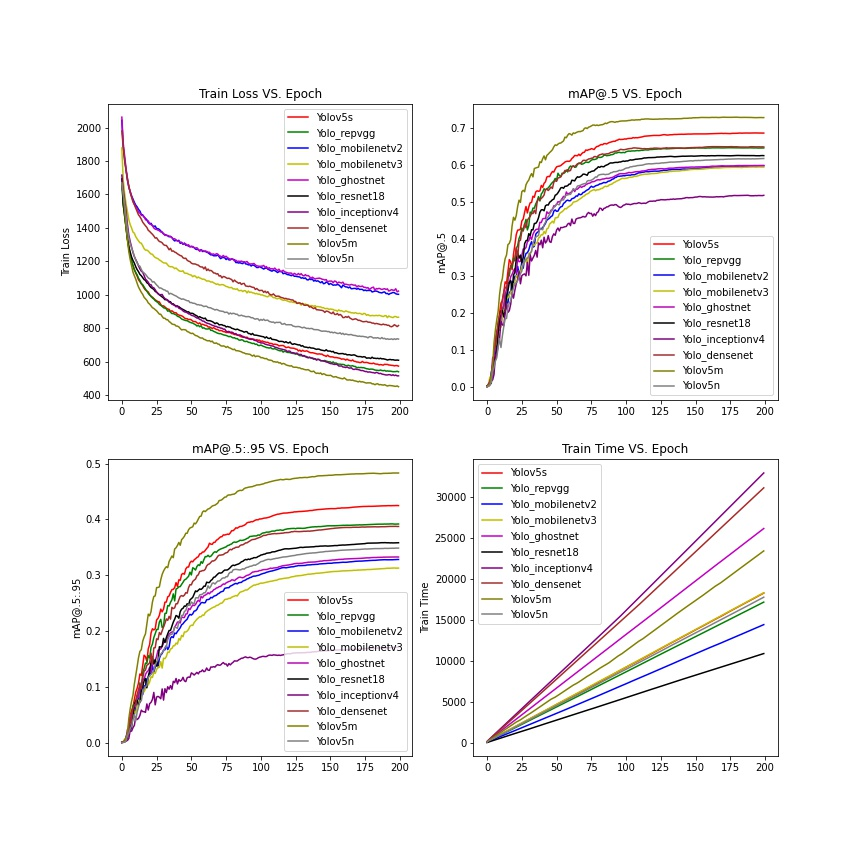
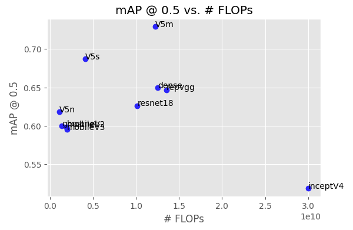
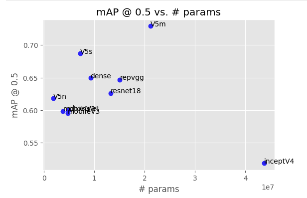
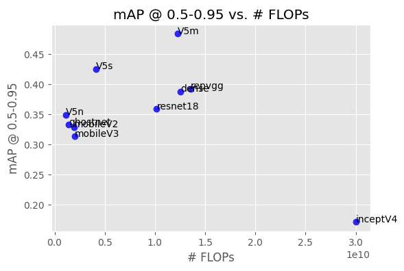
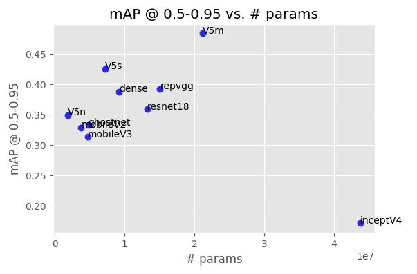
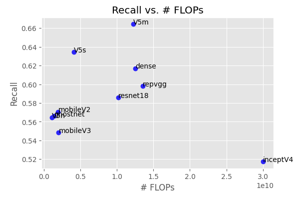
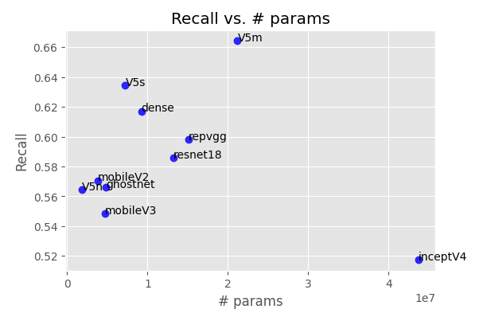

# Yolov5 with Different Backbones

This repository is based on the original [YOLOv5 by ultralytics](https://github.com/ultralytics/yolov5).

The purpose of this repository is to train Yolov5 with different backbones and test their performance. Try to figure out how other lightweight, SOTA, or popular classic backbones perform with the same settings with Yolov5.

## Usage

- clone the repo

```
$ git clone https://github.com/YuxiangChai/Yolov5-pytorch.git
```

- train the model

```
$ cd Yolov5_pytorch
$ python train.py --model yolo_resnet18 --cfg models/yolo_resnet18.yaml
```

- demostrate

```
$ python demo --weights runs/train/yolov5s/weights/best.pt --source ../datasets/VOC/images/test2007/000001.jpg --output runs/detect/yolov5s/
```

## Results

- train 



- evaluation













## Notice

This repository is based on [YOLOv5 by ultralytics](https://github.com/ultralytics/yolov5).

So code files may lack comments.